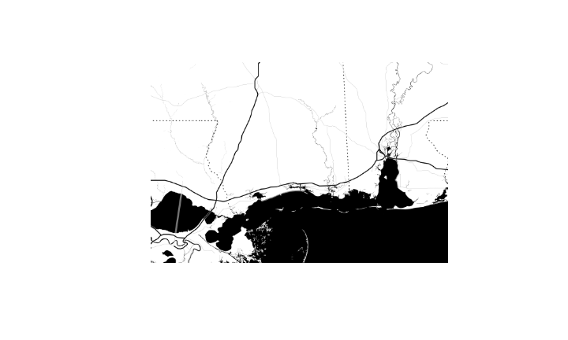
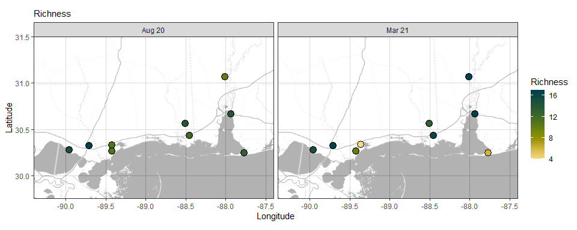
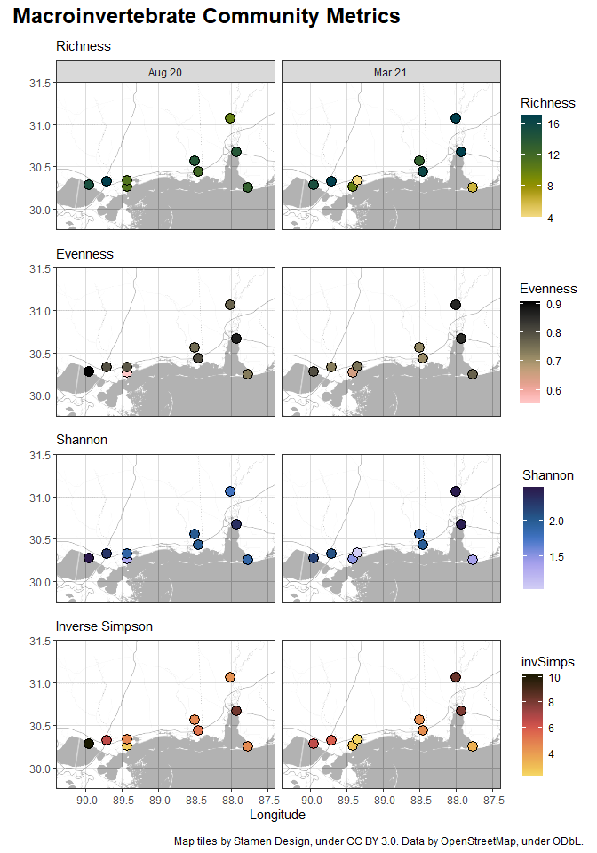

How to make quick and easy static maps in R
================
Alex Bauer
August 01, 2022

-   [Getting started](#getting-started)
    -   [Loading packages](#loading-packages)
    -   [Loading data](#loading-data)
-   [Making a basic map](#making-a-basic-map)
    -   [1. Defining the geographic
        range](#1-defining-the-geographic-range)
    -   [2. Pulling map tiles](#2-pulling-map-tiles)
        -   [2.1 Modifiying the base map
            (Optional!)](#21-modifiying-the-base-map-optional)
    -   [3. Plotting sampling sites](#3-plotting-sampling-sites)
-   [Combining several maps in one
    graph](#combining-several-maps-in-one-graph)
    -   [1. Make individual plots](#1-make-individual-plots)
    -   [2. Combine plots into one
        figure](#2-combine-plots-into-one-figure)
    -   [3. Add annotations](#3-add-annotations)
-   [Saving the figure](#saving-the-figure)
-   [Acknowledgements](#acknowledgements)

An important aspect of any research using data collected in the
environment is to effectively communicate the geographic context of the
data. Maps allow for intuitive geographic data visualization, and making
simple static maps in base R is a relatively straightforward process.
This tutorial, however, will focus on creating slightly more advanced
(and prettier!) maps using the ggplot syntax.

Basic knowledge of R is required, as I will not go through steps such as
setting up a working directory, etc. If you are new to R, I highly
recommended the freely available [R for Data
Science](https://r4ds.had.co.nz/) by Hadley Wickham & Garrett Grolemund.

# Getting started

## Loading packages

Lets start with loading a few packages we will need to wrangle our data:

``` r
# wrangling packages
library(tidyverse)
library(here) # here makes a project transportable, and allows us to create dynamic file paths
library(janitor) # clean_names
library(readxl) # read excel files

# use here from the here package
here <- here::here
# use clean_names from the janitor package
clean_names <- janitor::clean_names
```

In addition, we will require the following packages for data
visualization:

``` r
# graphing packages
library(ggplot2) # tidyverse data visualization package
library(ggmap) # pulls map from source
library(patchwork) # for structuring multiplot graphs
library(scico) # for color palettes that are both beautiful and universally readable. For more information visit https://www.fabiocrameri.ch/colourmaps/.
library(extrafont) # to access the fonts installed on your device

# load device fonts
loadfonts() # only necessary if you are using the extrafont package 
```

Feel free to use other color palettes instead of `scico` (but keep in
mind that you will have to adjust the code for your plot accordingly).
If you are in need of inspiration, maybe this list of [recommended color
palettes for data vis in
R](https://github.com/stars/amybauer/lists/r-color-palettes) (curated by
my lovely sister Amy) will help to get you started!

Additionally, loading `extrafont` is optional, should you be happy with
the default fonts. If you want to use a font installed on your device
that isn’t *Arial*, *Helvetica*, *Times*, or *Courier*, you will need to
install and load the `extrafont` package. You will then need to import
your fonts using `font_import()` - you can do this directly in your
console, as you will need to run this command only once!

## Loading data

Next, we need the data we want to display on our map. In this case, I
want to map specific ecological diversity metrics for each sampling
point. Luckily, I already have a nifty little excel sheet at hand that
contains both metadata and a number of calculated diversity metrics for
each site and sampling event. Let’s go ahead and load the file:

``` r
file_name <- "SS-InvCommunitites_Metrics-wide.xlsx"

file_path <- here(data_folder, file_name) # paste together parts of the address
my_file <- read_excel(file_path)

SS_ICM <- clean_names(my_file) # ICM: invertebrate community metrics
```

*On a sidenote: I like to work with relative file paths as I keep some
of my work in the cloud, hence the extra steps. While I recommend using
relative paths, you can also read in your file using an absolute file
path, and skip the first two steps.*

<details>
<summary>
**To take a look at my table, you can expand this tab.**
</summary>

As you can see, this table contains everything we need - coordinates
**and** the information I want to map. And it is already in wide format,
too!

<table class="table table table-condensed table-responsive" style="font-size: 9px; margin-left: auto; margin-right: auto; margin-left: auto; margin-right: auto;">
<caption style="font-size: initial !important;">
Macroinvertebrate Community - Diversity Metrics
</caption>
<thead>
<tr>
<th style="text-align:left;">
site
</th>
<th style="text-align:left;">
state
</th>
<th style="text-align:right;">
latitude
</th>
<th style="text-align:right;">
longitude
</th>
<th style="text-align:right;">
richness
</th>
<th style="text-align:right;">
shannon
</th>
<th style="text-align:right;">
shannon_entrophy
</th>
<th style="text-align:right;">
simpson
</th>
<th style="text-align:right;">
inv_simpson
</th>
<th style="text-align:right;">
evenness
</th>
</tr>
</thead>
<tbody>
<tr grouplength="9">
<td colspan="10" style="border-bottom: 1px solid;">
<strong>August 2020</strong>
</td>
</tr>
<tr>
<td style="text-align:left;padding-left: 2em;" indentlevel="1">
AL1
</td>
<td style="text-align:left;">
Alabama
</td>
<td style="text-align:right;">
31.0651
</td>
<td style="text-align:right;">
-88.0111
</td>
<td style="text-align:right;">
10
</td>
<td style="text-align:right;">
1.7658
</td>
<td style="text-align:right;">
5.8460
</td>
<td style="text-align:right;">
0.7676
</td>
<td style="text-align:right;">
4.3024
</td>
<td style="text-align:right;">
0.7669
</td>
</tr>
<tr>
<td style="text-align:left;padding-left: 2em;" indentlevel="1">
AL2
</td>
<td style="text-align:left;">
Alabama
</td>
<td style="text-align:right;">
30.6684
</td>
<td style="text-align:right;">
-87.9345
</td>
<td style="text-align:right;">
14
</td>
<td style="text-align:right;">
2.3028
</td>
<td style="text-align:right;">
10.0020
</td>
<td style="text-align:right;">
0.8781
</td>
<td style="text-align:right;">
8.2006
</td>
<td style="text-align:right;">
0.8726
</td>
</tr>
<tr>
<td style="text-align:left;padding-left: 2em;" indentlevel="1">
AL3
</td>
<td style="text-align:left;">
Alabama
</td>
<td style="text-align:right;">
30.2483
</td>
<td style="text-align:right;">
-87.7701
</td>
<td style="text-align:right;">
13
</td>
<td style="text-align:right;">
1.8851
</td>
<td style="text-align:right;">
6.5870
</td>
<td style="text-align:right;">
0.7801
</td>
<td style="text-align:right;">
4.5473
</td>
<td style="text-align:right;">
0.7349
</td>
</tr>
<tr>
<td style="text-align:left;padding-left: 2em;" indentlevel="1">
LA1
</td>
<td style="text-align:left;">
Louisiana
</td>
<td style="text-align:right;">
30.3258
</td>
<td style="text-align:right;">
-89.7093
</td>
<td style="text-align:right;">
17
</td>
<td style="text-align:right;">
2.2624
</td>
<td style="text-align:right;">
9.6064
</td>
<td style="text-align:right;">
0.8479
</td>
<td style="text-align:right;">
6.5764
</td>
<td style="text-align:right;">
0.7985
</td>
</tr>
<tr>
<td style="text-align:left;padding-left: 2em;" indentlevel="1">
LA2
</td>
<td style="text-align:left;">
Louisiana
</td>
<td style="text-align:right;">
30.2788
</td>
<td style="text-align:right;">
-89.9543
</td>
<td style="text-align:right;">
15
</td>
<td style="text-align:right;">
2.4611
</td>
<td style="text-align:right;">
11.7180
</td>
<td style="text-align:right;">
0.9022
</td>
<td style="text-align:right;">
10.2234
</td>
<td style="text-align:right;">
0.9088
</td>
</tr>
<tr>
<td style="text-align:left;padding-left: 2em;" indentlevel="1">
MS1
</td>
<td style="text-align:left;">
Mississippi
</td>
<td style="text-align:right;">
30.5603
</td>
<td style="text-align:right;">
-88.5047
</td>
<td style="text-align:right;">
14
</td>
<td style="text-align:right;">
1.9997
</td>
<td style="text-align:right;">
7.3870
</td>
<td style="text-align:right;">
0.7851
</td>
<td style="text-align:right;">
4.6538
</td>
<td style="text-align:right;">
0.7577
</td>
</tr>
<tr>
<td style="text-align:left;padding-left: 2em;" indentlevel="1">
MS2
</td>
<td style="text-align:left;">
Mississippi
</td>
<td style="text-align:right;">
30.4363
</td>
<td style="text-align:right;">
-88.4525
</td>
<td style="text-align:right;">
12
</td>
<td style="text-align:right;">
1.9936
</td>
<td style="text-align:right;">
7.3417
</td>
<td style="text-align:right;">
0.8077
</td>
<td style="text-align:right;">
5.1990
</td>
<td style="text-align:right;">
0.8023
</td>
</tr>
<tr>
<td style="text-align:left;padding-left: 2em;" indentlevel="1">
MS3
</td>
<td style="text-align:left;">
Mississippi
</td>
<td style="text-align:right;">
30.2626
</td>
<td style="text-align:right;">
-89.4228
</td>
<td style="text-align:right;">
11
</td>
<td style="text-align:right;">
1.3223
</td>
<td style="text-align:right;">
3.7519
</td>
<td style="text-align:right;">
0.5946
</td>
<td style="text-align:right;">
2.4667
</td>
<td style="text-align:right;">
0.5514
</td>
</tr>
<tr>
<td style="text-align:left;padding-left: 2em;" indentlevel="1">
MS4
</td>
<td style="text-align:left;">
Mississippi
</td>
<td style="text-align:right;">
30.3289
</td>
<td style="text-align:right;">
-89.4228
</td>
<td style="text-align:right;">
11
</td>
<td style="text-align:right;">
1.8912
</td>
<td style="text-align:right;">
6.6275
</td>
<td style="text-align:right;">
0.7847
</td>
<td style="text-align:right;">
4.6452
</td>
<td style="text-align:right;">
0.7887
</td>
</tr>
<tr grouplength="9">
<td colspan="10" style="border-bottom: 1px solid;">
<strong>March 2021</strong>
</td>
</tr>
<tr>
<td style="text-align:left;padding-left: 2em;" indentlevel="1">
AL1
</td>
<td style="text-align:left;">
Alabama
</td>
<td style="text-align:right;">
31.0651
</td>
<td style="text-align:right;">
-88.0111
</td>
<td style="text-align:right;">
17
</td>
<td style="text-align:right;">
2.4394
</td>
<td style="text-align:right;">
11.4658
</td>
<td style="text-align:right;">
0.8800
</td>
<td style="text-align:right;">
8.3353
</td>
<td style="text-align:right;">
0.8610
</td>
</tr>
<tr>
<td style="text-align:left;padding-left: 2em;" indentlevel="1">
AL2
</td>
<td style="text-align:left;">
Alabama
</td>
<td style="text-align:right;">
30.6684
</td>
<td style="text-align:right;">
-87.9345
</td>
<td style="text-align:right;">
17
</td>
<td style="text-align:right;">
2.4176
</td>
<td style="text-align:right;">
11.2189
</td>
<td style="text-align:right;">
0.8746
</td>
<td style="text-align:right;">
7.9751
</td>
<td style="text-align:right;">
0.8533
</td>
</tr>
<tr>
<td style="text-align:left;padding-left: 2em;" indentlevel="1">
AL3
</td>
<td style="text-align:left;">
Alabama
</td>
<td style="text-align:right;">
30.2483
</td>
<td style="text-align:right;">
-87.7701
</td>
<td style="text-align:right;">
6
</td>
<td style="text-align:right;">
1.3823
</td>
<td style="text-align:right;">
3.9842
</td>
<td style="text-align:right;">
0.7034
</td>
<td style="text-align:right;">
3.3719
</td>
<td style="text-align:right;">
0.7715
</td>
</tr>
<tr>
<td style="text-align:left;padding-left: 2em;" indentlevel="1">
LA1
</td>
<td style="text-align:left;">
Louisiana
</td>
<td style="text-align:right;">
30.3258
</td>
<td style="text-align:right;">
-89.7093
</td>
<td style="text-align:right;">
17
</td>
<td style="text-align:right;">
2.0694
</td>
<td style="text-align:right;">
7.9200
</td>
<td style="text-align:right;">
0.8289
</td>
<td style="text-align:right;">
5.8450
</td>
<td style="text-align:right;">
0.7304
</td>
</tr>
<tr>
<td style="text-align:left;padding-left: 2em;" indentlevel="1">
LA2
</td>
<td style="text-align:left;">
Louisiana
</td>
<td style="text-align:right;">
30.2788
</td>
<td style="text-align:right;">
-89.9543
</td>
<td style="text-align:right;">
15
</td>
<td style="text-align:right;">
2.1688
</td>
<td style="text-align:right;">
8.7476
</td>
<td style="text-align:right;">
0.8463
</td>
<td style="text-align:right;">
6.5045
</td>
<td style="text-align:right;">
0.8009
</td>
</tr>
<tr>
<td style="text-align:left;padding-left: 2em;" indentlevel="1">
MS1
</td>
<td style="text-align:left;">
Mississippi
</td>
<td style="text-align:right;">
30.5603
</td>
<td style="text-align:right;">
-88.5047
</td>
<td style="text-align:right;">
13
</td>
<td style="text-align:right;">
1.8532
</td>
<td style="text-align:right;">
6.3802
</td>
<td style="text-align:right;">
0.7705
</td>
<td style="text-align:right;">
4.3582
</td>
<td style="text-align:right;">
0.7225
</td>
</tr>
<tr>
<td style="text-align:left;padding-left: 2em;" indentlevel="1">
MS2
</td>
<td style="text-align:left;">
Mississippi
</td>
<td style="text-align:right;">
30.4363
</td>
<td style="text-align:right;">
-88.4525
</td>
<td style="text-align:right;">
16
</td>
<td style="text-align:right;">
1.9713
</td>
<td style="text-align:right;">
7.1801
</td>
<td style="text-align:right;">
0.7764
</td>
<td style="text-align:right;">
4.4717
</td>
<td style="text-align:right;">
0.7110
</td>
</tr>
<tr>
<td style="text-align:left;padding-left: 2em;" indentlevel="1">
MS3
</td>
<td style="text-align:left;">
Mississippi
</td>
<td style="text-align:right;">
30.2626
</td>
<td style="text-align:right;">
-89.4228
</td>
<td style="text-align:right;">
10
</td>
<td style="text-align:right;">
1.4918
</td>
<td style="text-align:right;">
4.4452
</td>
<td style="text-align:right;">
0.6372
</td>
<td style="text-align:right;">
2.7560
</td>
<td style="text-align:right;">
0.6479
</td>
</tr>
<tr>
<td style="text-align:left;padding-left: 2em;" indentlevel="1">
MS5
</td>
<td style="text-align:left;">
Mississippi
</td>
<td style="text-align:right;">
30.3365
</td>
<td style="text-align:right;">
-89.3640
</td>
<td style="text-align:right;">
4
</td>
<td style="text-align:right;">
1.0336
</td>
<td style="text-align:right;">
2.8111
</td>
<td style="text-align:right;">
0.5455
</td>
<td style="text-align:right;">
2.2000
</td>
<td style="text-align:right;">
0.7456
</td>
</tr>
</tbody>
</table>
</details>

If you looked at the table, you saw that it contains the latitude and
longitude for each sampling site - great!

# Making a basic map

## 1. Defining the geographic range

Now it is time for us to get into the actual map-making progress. The
first step should be to identify the area of interest, so we can define
the overall geographic range we want our map to cover. I did this by
looking up my sites’ min and max latitude and longitude, respectively.
You can run a quick search in R to help you find these values. Once you
have identified the geospatial extent of your sampling sites, go ahead
and define the coordinate range you want your map to have. Make sure to
choose a range that will include your min and max values for both the
longitude and the latitude. We will save this range as a new variable -
this way, it is very easy for us to go back later and play around with
the coordinates until we are happy with how the map looks.

To set the range, we start with the coordinates that will mark the
**bottom left** corner of our soon-to-be map, followed by the
coordinates of the **top right** corner.

``` r
## Investigate the geographic range of datapoints
# > min(SS_ICM$longitude)
# [1] -89.9543
# > max(SS_ICM$longitude)
# [1] -87.77006
# > min(SS_ICM$latitude)
# [1] 30.24828
# > max(SS_ICM$latitude)
# [1] 31.06512

# Define coordinate range
myLocation <- c(-90.4, 29.75, -87.4, 31.5)
```

## 2. Pulling map tiles

For this tutorial, we are working with `ggmap`. Using this package
allows us to visualize our data by combining information of static maps
from a number of sources (i.e., Google Maps, OpenStreetMap, Stamen Maps
or CloudMade Maps) with the layered grammar of `ggplot2`. If you are
interested in the different options this package provides, take a closer
look at [ggmap: Spatial Visualization with
ggplot2](https://journal.r-project.org/archive/2013-1/kahle-wickham.pdf).

I like using [Stamen Maps](http://maps.stamen.com), because they offer a
variety of map types, and all map tile sets are available under a
Creative *Commons Attribution (CC BY 3.0)* license.

For this particular map, we will use the `toner-background` maptype. All
my sites are relatively close together and I do not want location labels
to get in my way. Additionally, we should set a zoom level. Increased
zoom means increased level of detail, but keep in mind that the number
of tiles that need to be loaded in will increase quite substantially as
well. I recommend starting low and working your way up until you are
satisfied. Here, we will go with `zoom = 8`.

``` r
myMap <- get_stamenmap(bbox = myLocation,
  maptype = "toner-background", # toner background: bw, no labels
  zoom = 8)
```

This little code chunk will give us the following output:



If you want to change the extend of your map (change the range defined
in `myLocation`), play around with the `zoom`, or give another `maptype`
a try, this would be a great time to do so! I am happy with both the
level of detail and the area this map covers. I do think, however, that
the black background is too harsh. While we could pull different tiles
using \`maptype = “toner-lite”, there is (sadly) no lite background
toner map. If you like the the black and white background map, or
decided to use another maptype, you can go ahead and jump over to the
next section.

### 2.1 Modifiying the base map (Optional!)

Unfortunately, there is no easy way to change the opacity of base maps,
or directly change the background color. Instead, we will have to
perform three additional steps: First, we need to the attributes of
`myMap` into a new dataset:

``` r
mapatt <- attributes(myMap)
```

Now we can create a new map, `map_transparent`, and change the
transparency using `alpha.f`. I found that `alpha.f = 0.3` worked well
for me but feel free to play around for a bit.

``` r
map_transparent <- matrix(adjustcolor(myMap, alpha.f = 0.3), nrow = nrow(myMap))
```

And lastly, we assign the attributes of our initial map to our newly
created `map_transparent`:

``` r
attributes(map_transparent) <- mapatt
```

## 3. Plotting sampling sites

And now, it is finally time to make our fist map! We can now use ggmap
and add elements in the same way we would add them to any other
`ggplot2` plot.

You might remember that my excel table contained a number of community
diversity metrics as well as different sampling events. Let’s say we
want to look at the species richness across sites in August 2020. First,
I want to create a new data frame that will only contain the `Aug 20`
data:

``` r
SS_ICM_Aug20 <- SS_ICM %>%
  filter(date == "Aug 20")
```

For the purpose of this tutorial we will look at two options to display
your data:

-   **Option 1:** using continuous color scales. I like this option when
    the data has continuous values, when my data covers a wide range of
    values, or I have a lot of datapoints that are in close proximity to
    each other.
-   **Option 2:** representing the value of an (additional) numeric
    variable through the size of the plotted dots.

Remember: we are using our semi-transparent base map here, so we need to
add a white background to the graph, which we will do by adding
`theme(panel.background = element_rect(fill = 'white'))`.

``` r
# Option 1: continuous scale

map_color <- ggmap(map_transparent) +
  geom_point(aes(x = longitude, y = latitude, fill = richness),
             data = SS_ICM_Aug20,
             color = "black",
             pch = 21,
             size = 4) +
  theme_bw() +
  theme(panel.grid = element_line("#cccccc"),
        panel.background = element_rect(fill = 'white')) +
  xlab("Longitude") +
  ylab("Latitude") +
  labs(subtitle="Richness") +
  ggtitle('Option 1')

# Option 2: point size by value

map_size <- ggmap(map_transparent) +
  geom_point(aes(x = longitude, y = latitude, size = richness),
             data = SS_ICM_Aug20,
             color = "black",
             alpha=0.5)+
  theme_bw() +
  theme(panel.grid = element_line("#cccccc"),
        panel.background = element_rect(fill = 'white')) +
  xlab("Longitude") +
  ylab("Latitude") +
  labs(subtitle="Richness") +
  ggtitle('Option 2')
```

If you choose option one, play around with the point size. Depending on
the number of data points you want to display, you might want to de- or
increase their size. Of course, you can also go ahead and combine both
methods of visualization. In the end, it will simply come down to your
data and what kind of information you want to bring across. If unsure
which option would work best, I recommend you play around a bit. More
often than not, seeing the output will help you figure out what you do
(or do not) want to do!


This looks pretty good already. But I do not particularly care for the
default font, and I do want to use a different color palette for each
diversity metric. Plus, my data frame contains data for two different
sampling events, and I want to know if (and how) my values differ
between sites and dates. So let’s add `facet_wrap`, a custom color
palette, and a new base family to our plot:

``` r
map_r <- ggmap(map_transparent) +
  geom_point(aes(x = longitude, y = latitude, fill = richness),
             data = SS_ICM,
             color = "black",
             pch = 21,
             size = 4) +
  facet_wrap(~ date) +
  scale_fill_scico(palette="bamako", direction =-1, end = 0.95, name = "Richness") +
  theme_bw(base_family = "Arial Narrow") +
  theme(panel.grid = element_line("#cccccc"),
        panel.background = element_rect(fill = 'white')) +
  xlab("Longitude") +
  ylab("Latitude") +
  labs(subtitle="Richness")
```

And here is what it looks like now:



I am pretty happy with the map. You can go ahead and save the map using
`ggsave()` and be done with it. I recommend using `ggsave()` as you will
be able to define the format, size, and resolution of the saved graph -
something very important if you plan to have your map printed, e.g., for
a poster or a publication. I will provide an example at the end of this
tutorial, but personally, I am not done yet.

# Combining several maps in one graph

I want several of my diversity metrics to be displayed and combined into
one figure. The easiest way would be to transpose my data into a long
format, in which one column would contain all the different metrics, and
then apply `facet_wrap()`. However, I would run out of options to assign
different color palettes very soon, and I want each metric to have its
own palette.

So instead of using `facet_wrap()`, we will take the long route of
making separate graphs for each metric. On top of that, I want to
achieve the following:

-   only the top graph should have the facet labels, and
-   only the bottom graph should have x-axis labels.

## 1. Make individual plots

For my graph, I chose a total of 4 commonly used diversity metrics
(Species richness, Species evenness, Shannon index, and inverse Simpson
index).

``` r
# 1st plot: Richness
p1 <- ggmap(map_transparent) +
  geom_point(aes(x = longitude, y = latitude, fill = richness),
             data = SS_ICM,
             color = "black",
             pch = 21,
             size = 4) +
  facet_wrap(~ date) +
  scale_fill_scico(palette="bamako", direction =-1, end = 0.95, name = "Richness") +
  theme_bw(base_family = "Arial Narrow") +
  theme(panel.grid = element_line("#cccccc"),
        panel.background = element_rect(fill = 'white')) +
  theme(axis.title.x=element_blank(),
        axis.text.x=element_blank(),
        axis.ticks.x=element_blank()) +
  xlab("") +
  ylab("") +
  labs(subtitle="Richness")

# 2nd plot: Eveness
p2 <- ggmap(map_transparent) +
  geom_point(aes(x = longitude, y = latitude, fill = evenness),
             data = SS_ICM,
             color = "black",
             pch = 21,
             size = 4) +
  facet_wrap(~ date) +
  scale_fill_scico(palette="turku", direction =-1, end = 0.9, name = "Evenness") +
  theme_bw(base_family = "Arial Narrow") +
  theme(panel.grid = element_line("#cccccc"),
        panel.background = element_rect(fill = 'white')) +
  theme(axis.title.x=element_blank(),
        axis.text.x=element_blank(),
        axis.ticks.x=element_blank()) +
  theme(strip.text.x = element_blank()) +
  xlab("") +
  ylab("") +
  labs(subtitle="Evenness")

# 3rd plot: Shannon
p3 <- ggmap(map_transparent) +
  geom_point(aes(x = longitude, y = latitude, fill = shannon),
             data = SS_ICM,
             color = "black",
             pch = 21,
             size = 4) +
  facet_wrap(~ date) +
  scale_fill_scico(palette="devon", direction =-1, end = 0.8, name = "Shannon") +
  theme_bw(base_family = "Arial Narrow") +
  theme(panel.grid = element_line("#cccccc"),
        panel.background = element_rect(fill = 'white')) +
  theme(axis.title.x=element_blank(),
        axis.text.x=element_blank(),
        axis.ticks.x=element_blank()) +
  theme(strip.text.x = element_blank()) +
  xlab("") +
  ylab("") +
  labs(subtitle="Shannon")

# 4th plot: invSimpson
p4 <- ggmap(map_transparent) +
  geom_point(aes(x = longitude, y = latitude, fill = inv_simpson),
             data = SS_ICM,
             color = "black",
             pch = 21,
             size = 4) +
  facet_wrap(~ date) +
  scale_fill_scico(palette="lajolla", begin = 0.2, name = "invSimps") +
  theme_bw(base_family = "Arial Narrow") +
  theme(panel.grid = element_line("#cccccc"),
        panel.background = element_rect(fill = 'white')) +
  theme(strip.text.x = element_blank()) +
  labs(x="Longitude", y="",
       subtitle = "Inverse Simpson") +
  ylab("")
```

You will notice that I included a line to remove the facet labels
(`theme(strip.text.x = element_blank())`) for plots 2 to 4, and a line
to remove the the x-axis elements
(`theme(axis.title.x=element_blank(), axis.text.x=element_blank(), axis.ticks.x=element_blank())`)
from all but the last plot. These lines are required the achieve the
additional objectives I stated above.

## 2. Combine plots into one figure

Now that we have all our plots, we need to combine them into one figure.
For this, I like to use the `patchwork` package as this package makes
the process very easy. If you want to learn more about the options it
provides make sure to check out [this online
resource](https://patchwork.data-imaginist.com/). For now, all you need
to know is that we need to use `/` if want the plots to be on top of
each other:

``` r
# combine plots into one figure
div_metrics <- (p1 / p2 / p3 / p4)

print(div_metrics)
```


Not bad, right? But there is still some room for improvement.

## 3. Add annotations

Some of the most needed additions to any plot include title, subtitle,
and captions. Using the `patchwork` package we can add these elements
using the `plot_annotation()` function, and we can further draw from
`ggplot2:theme` elements to make adjustments to the style. For this
particular figure I will add a title as well as a caption:

``` r
figure <- div_metrics +
  plot_annotation(title = 'Macroinvertebrate Community Metrics',
                  caption = 'Map tiles by Stamen Design, under CC BY 3.0. Data by OpenStreetMap, under ODbL.',
                  theme = theme(plot.title = element_text(size = 18,
                                                          face = "bold"),
                                ),
                  ) & theme(text = element_text('Arial Narrow'))
```

Our figure now looks like this:



Pretty neat, right?

# Saving the figure

Now, all that remains is to save our new figure. Using the default
settings in R might work well enough for web applications etc., but if
you want to use your newly created maps, e.g., for a print publication
or a poster, we need to ramp up the resolution! Luckily, we can use
ggplot2’s `ggsave()` function. This function allows you to define the
format of the output file, as well as the size and resolution! For
print, you want to go with a high dpi - I recommend a minimum of 300
dpi. If you are saving your figure for publication, check the journal’s
requirements!

``` r
output_name <- "SS_ICM_maps.png"

output_plot_path <- here(output_folder, "Plots")

ggsave(filename = output_name,
       path = output_plot_path,
       plot=figure, # name of your plot (defaults to last plot if you do not specify)
       device="png",
       height=25.5, width=18.5, units="cm",
       dpi = 500) 
```

As always, I am using relative file paths, but you could use an absolute
file path instead.

And that’s it. You are done! I hope you are happy with your map and that
you learned something new while following along!

# Acknowledgements

Data used to compile this tutorial was generated through work supported
by the joint NSF-NIH-NIFA Ecology and Evolution of Infectious Disease
program (DEB 1911457) to MEB, JFG, JLP, HRJ and MWS.
